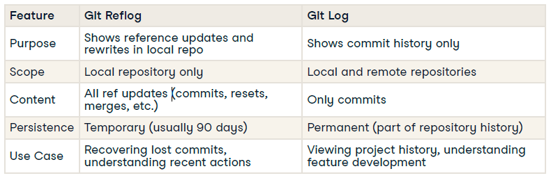

# Git Fundamentals

## Advanced Git - 02 Git History and Exploration

### Cherry-Picking

Applies the changes from a specific commit to another branch, to:
- Apply specific bug fixes across branches
- Selectively apply experimental changes
- Recover lost commits

Cherry-Pick Single Commit: `git cherry-pick <commit-hash>`

Cherry-Pick Multiple Commits: `git cherry-pick <hash1> <hash2> ..`

### Resolving cherry-pick conflicts

Conflict resolution steps:
- Manually edit conflicting files
- Add resolved files to staging using `git add <resolved-files>`
- Continue with the cherry-pick process by running `--continue` flag: `git cherry-pick --continue`

1) You've developed several features in the advanced-transform branch, but you only want to apply the error handling improvement to the main branch immediately.

Cherry-pick the commit that implements error handling in the advanced-transform branch. The commit hash is ca17593.

```
git cherry-pick ca17593
```

2) You want to bring the performance optimization commit to the main branch, but after starting the cherry-pick, you realize it's not compatible with the current state of the main branch.

Cherry-pick the commit that implements the performance optimization in the advance-transform branch. The commit hash is 6886b56.

```
git cherry-pick 6886b56
git cherry-pick --abort
```

### Bisect

A tool that uses **binary search to find the commit** that introduced a bug.

Purpose
- Find the bad commit fast
- Essential for data debugging
- Speeds up root cause analysis

### Bisect - start

1. Initiate git bisect session: `git bisect start`
2. Initialize the current state as a bad state: `git bisect bad`
3. Mark the last known good state: `git bisect good <commit-hash>`

### Bisect - search

1. Marks the commit state as a bad commit: `git bisect bad`
2. Marks the commit state as a good commit: `git bisect good`

### Bisect - automated search

Checks if the commit version is good or bad by running an automated test script: `git bisect run <script_name>`

- The script must return 0 if the tests passed.
- If the tests fail, it should return a non-zero number.

3) A bug has been reported in the ETL pipeline in our flight data pipeline project. The latest version doesn't work, but you know it was working 10 commits ago. Start the git bisection process to begin finding the commit that introduced the bug.

```
git log -5
git bisect star
git bisect bad HEAD # Mark the current commit at HEAD as bad using git bisect
git bisect good 75e3424 # The last known good commit was 13 commits ago. The hash of this commit is 75e3424
```

4) You've written a script test_etl.sh that can automatically detect if the bug is present. Run git bisect with your automated test script to automatically detect whether the bug exists in the returned commit.

```
git bisect run ./test_etl.sh
git bisect reset
```

### Git Filter Repo

A tool for rewriting Git repository history quickly and safely: `git filter-repo`

- Remove sensitive data (e.g., passwords, tokens)
- Clean up unnecessary files
- Restructure/rename repositories
- Reduce repository size

Steps:
- Install git filter-repo using pip: `pip install git-filter-repo`
- Remove secrets.txt from every commit: `git filter-repo --path secrets.txt --invert-paths`

Tips:
- Always back up your repository before using filter-repo
- Coordinate with collaborators before pushing rewritten history

5) In your flight data pipeline project, you've accidentally committed the file, config.ini, containing sensitive API keys. You need to remove this file from the entire repository history using filter-repo.

Use git filter-repo to remove the config.ini file from the entire history. Use the --force flag to override filter-repo restriction.

```
git filter-repo --path config.ini --invert-paths --force
```

### Git reflog

- Local record of ALL reference updates in our repository
- Reflog is stored in on our local system under the .git/logs/refs/heads/ directory
- Records changes to branch tips and HEAD position
- Acts a safeguard for our Git operations
- Helps recover accidental changes or deletions



Recovering Deleted Branches:
- Identify the hash of the commit at the tip of deleted branch using git reflog: `git reflog`
- Use git checkout to move HEAD to the commit hash of the deleted branch: `git checkout <hash>`
- Create a new branch using the commit HEAD is currently pointed: `git switch -c <branch-name>`

### Git Reset

- Moves the HEAD to the specific commit object.
- Depending on the reset type, the working and staging area is updated

6) Your task is to recover this lost commit and apply it to a new branch.

```
git reflog
git switch -c recovered_transformation
git cherry-pick a7f8091
```