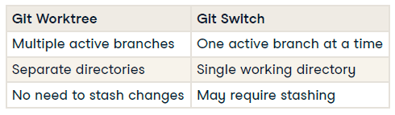

# Git Fundamentals

## Advanced Git - 03 Advanced Repository Management

### Git Worktrees

- Can "checkout" multiple branches in your workspace.
- Similar to a repo checkout, but efficient
- No need for stashing changes
- No need to switch between branches during development



Create new work tree from <branch> into directory <path>: `git worktree add <path> <branch>`

Lists all active worktrees: `git worktree list`

Removes a worktree from a <path>: `git worktree remove <path>`

When to use:
- Working on multiple features **simultaneously**
- Handling urgent bug fixes **without disrupting ongoing work**

Best practices:
- Use clear naming conventions for worktree directories
- Regularly prune unused worktrees to keep the workspace clean

1) You're working on the feature_branch for the flight data pipeline project, but you need to quickly fix a bug in the main branch without switching branches.

Assume that bugfix branch already exists. Create a new worktree to fix the bug issue named bugfix in the ../bugfix directory.

```
git worktree add ../bugfix bugfix
cd ../bugfix
git status
```

2) After fixing the bug, you want to clean up by removing the ../bugfix worktree you created

```
git worktree list
git worktree remove bugfix
```

### Git Submodules

- A **repository nested within another repository**
- Separate version control and history
- Submodule changes does not affect main repo
- Main repo can reference a specific version of a submodule

**Adding** a submodule using the link or directory under path folder: `git submodule add <repository link|dir> <path>`

**List** all submodules in a project: `git submodule status`

**Updates** all submodules where the source code is on your local computer: `git submodule update --init`

**Remove** a submodule process:
- Deinitialize the submodule: `git submodule deinit <submodule_name>`
- Remove the submodule from git repo index: `git rm <path>`

**Extracting** a submodule from a large repo
- Copy all files that need to be in the new submodule repo into another folder outside the repo
- Inside the new folder, create a new repository for the submodule: `git init <new-submodule>`
- Use git filter-repo to extract the relevant files and history from the main project: `git filter-repo --path <extract_path> --invert-paths`
- Add the extracted repository as a submodule to the main project: `git submodule add <new-submodule_path> <path_to_store_submodule>`

Use cases:
- Managing external libraries
- Sharing code across projects
- Maintaining specific versions of dependencies

3) You're working on the ETL project and want to include a data validation library as a submodule to enhance your data processing capabilities.

Add a submodule under the libs/data_validator folder from your local repository at ../data_validator.

```
git submodule add ../data_validator libs/data_validator
git submodule status
```

### Git Large File Storage

- Git LFS: Git Large File Storage
- Replace large files in repo --> Small pointer files
- Large files separate from repo

Benefits:
- Reduced repository size
- Faster cloning and fetching

Git LFS **initialization** process:
- Initialize Git LFS: `git lfs install`
- Setup files to track and generate .gitattributes file: `git lfs track "*.csv"`
- Add to git index .gitattributes with tracking config: `git add .gitattributes`
- Commit new changes: `git commit -m "Track CSV files"`

Git LFS **update** process:
- Add new file using git add: `git add large_file.csv`
- Commit and push the changes: `git commit -m "Update large CSV file"`
- Download changes: `git pull`